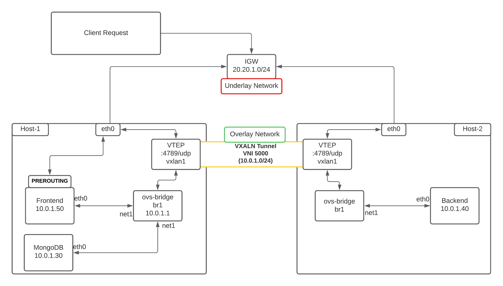

<!-- @format -->

# mern application run inside networks using VXLAN tunnel

i want to show you how run backend with database and frontend application in vxlan tunnel



## Host-1 and Host-2 Common Setup

    sudo apt-get update && sudo apt-get upgrade -y

### --------- INSTALL DOCKER ---------

```
sudo apt install docker.io -y
sudo systemctl start docker
sudo systemctl enable docker
sudo usermod -aG docker $USER
```

### --------- INSTALL Net-Tools and Open Vswitch ---------

    sudo apt -y install net-tools openvswitch-switch

    git clone https://github.com/hamzazahidulislam/mern-inside-vxlan && cd mern-inside-vxlan

### build inside Host-1

    docker build -t react-app ./client

### build inside Host-2

    docker build -t api-server ./server

# VPC IP Address

**VPC: IP Address (20.20.0.0/16)**\
 **Subnet: IP Address (20.20.1.0/24)**

# Container Network Specifications:

**net1: 10.0.1.0/24**\

### Host 1

#### Create first bridge **br1** for **net1**:

    sudo ovs-vsctl add-br br1

### Create internal port **net1** under bridge **br1**:

    sudo ovs-vsctl add-port br1 net1 -- set interface net1 type=internal

### Assign gateway IP to **net1** internal port:

    sudo ifconfig net1 10.0.1.1 netmask 255.255.255.0 up

### Create VXLAN tunnel port **vxlan1** for **net1**:

    sudo ovs-vsctl add-port br1 vxlan1 -- set interface vxlan1 type=vxlan options:remote_ip=172.16.20.100 options:key=5000

### Run Frontend application :

    sudo docker run -di --net none --name frontend react-app

### Now, attach **net1** into container **frontend** with IP configuration by below command:

    sudo ovs-docker add-port br1 eth0 frontend --ipaddress=10.0.1.50/24 --gateway=10.0.1.1

### Run MongoDB Database :

    sudo docker run -di --net none --name mongodb mongo:3.6-xenial

### Now, attach **net1** into container **mongodb** with IP configuration by below command:

    sudo ovs-docker add-port br1 eth0 mongodb --ipaddress=10.0.1.30/24 --gateway=10.0.1.1

### NAT for Internet connectivity:

If we want to enable internet connectivity for **net1** then first we need to enable IP forwarding on host machine. and keep remembering this is a temporary solution

    echo 'net.ipv4.ip_forward = 1' | sudo tee -a /etc/sysctl.conf
    sudo sysctl -p /etc/sysctl.conf

### For outside network access (Ex: internet) from **net1** interfaces or network, we have to configure **SNAT** or **MASQUERADE**. We will do this configuration using **iptables**. We will configure masquerad interface wise.

#### NAT configuration for **net1**:

    sudo iptables --append FORWARD --in-interface net1 --jump ACCEPT
    sudo iptables --append FORWARD --out-interface net1 --jump ACCEPT
    sudo iptables --table nat --append POSTROUTING --source 10.0.1.0/24 --jump MASQUERADE

### This is expected. Likewise, we need to do **DNAT** (Destination IP NAT)

    sudo iptables -t nat -A PREROUTING -d 20.20.1.145 -p tcp -m tcp --dport 3000 -j DNAT --to-destination 10.0.1.50:3000

#### Meaning, any request from exact `matched (-m)` **tcp** `protocol (-p)` with `Destination (-d)` IP 20.20.1.145 (_eth0 ip_) with `destination port (--dport)` 5000 will jump -j into **DNAT** rule to destination `192.168.0.2:5000`

### Host 2

#### Create first bridge **br1** for **net1**:

    sudo ovs-vsctl add-br br1

### Create internal port **net1** under bridge **br1**:

    sudo ovs-vsctl add-port br1 vxlan1 -- set interface vxlan1 type=vxlan options:remote_ip=172.16.10.100 options:key=5000

### Run Backend application :

    sudo docker run -di --net none --name backend api-server

### Now, attach **net1** into container **backend** with IP configuration by below command:

    sudo ovs-docker add-port br1 eth0 backend --ipaddress=10.0.1.40/24 --gateway=10.0.1.1

### you can check api from Host-1

    curl -X POST -H "Content-Type: application/json"  -d '{"email":"test@g.com","password":"123"}' http://10.0.1.40:5000/api/auth/register

    curl -X POST -H "Content-Type: application/json"  -d '{"email":"test@g.com","password":"123"}' http://10.0.1.50:3000/api/auth/login

### or you run script:

- #### clone project
        git clone https://github.com/hamzazahidulislam/mern-inside-vxlan && cd mern-inside-vxlan
- #### run script inside Host-1

        sudo bash ./host-1.sh ${remote_ip} ${eth0}

- #### run script inside Host-2
        sudo bash ./host-2.sh ${remote_ip} ${eth0}
